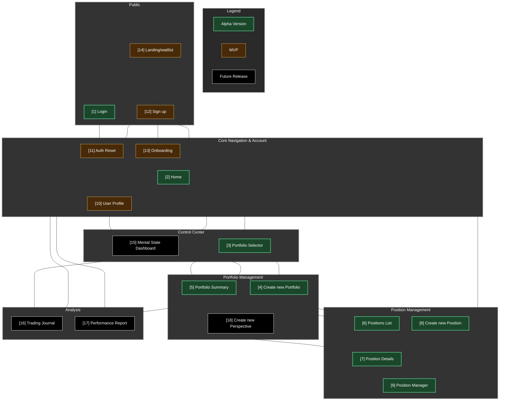

## Numisma Sitemap

```mermaid
flowchart TD
    %% Public section nodes
    landing["[14] Landing/waitlist"]
    signup["[12] Sign up"]
    login["[1] Login"]

    %% Core Navigation & Account section nodes - simplified Home label
    home["[2] Home"]
    user_profile["[10] User Profile"]
    auth_reset["[11] Auth Reset"]
    onboarding["[13] Onboarding"]

    %% Control Center nodes
    portfolio_selector["[3] Portfolio Selector"]
    mental_dashboard["[15] Mental State Dashboard"]

    %% Portfolio Management nodes
    create_portfolio["[4] Create new Portfolio"]
    portfolio_summary["[5] Portfolio Summary"]
    create_perspective["[18] Create new Perspective"]

    %% Position Management nodes
    create_position["[8] Create new Position"]
    positions_list["[6] Positions List"]
    position_details["[7] Position Details"]
    position_manager["[9] Position Manager"]

    %% Analysis nodes
    trading_journal["[16] Trading Journal"]
    performance_report["[17] Performance Report"]

    %% Feature Set Legend
    subgraph legend["Legend"]
        alpha_example["Alpha Version"]:::alpha
        mvp_example["MVP"]:::mvp
        future_example["Future Release"]:::future
    end

    %% Subgraphs - defining sections
    subgraph public["Public"]
        landing
        signup
        login
    end

    subgraph core_nav["Core Navigation & Account"]
        home
        user_profile
        auth_reset
        onboarding
    end

    subgraph nav_tools["Control Center"]
        portfolio_selector
        mental_dashboard
    end

    subgraph portfolio["Portfolio Management"]
        create_portfolio
        portfolio_summary
        create_perspective
    end

    subgraph positions["Position Management"]
        create_position
        positions_list
        position_details
        position_manager
    end

    subgraph analysis["Analysis"]
        trading_journal
        performance_report
    end

    %% Authentication flow connections
    landing --> signup
    signup --> onboarding
    signup --> auth_reset
    login --> home
    login --> auth_reset
    onboarding --> home

    %% Main navigation connections - modified to include mode connections
    home --> portfolio_selector
    home --> mental_dashboard
    home --> user_profile
    user_profile --> mental_dashboard

    %% Mode connections now directly from Home to destinations
    home --> trading_journal
    home --> performance_report
    home --> position_manager

    %% NEW CONNECTIONS from Mental State Dashboard
    mental_dashboard --> trading_journal
    mental_dashboard --> portfolio_summary

    %% Portfolio connections
    portfolio_selector --> create_portfolio
    portfolio_selector --> portfolio_summary
    create_portfolio --> create_position
    portfolio_summary --> positions_list

    %% Position connections
    positions_list --> position_details
    create_position --> position_manager
    position_details --> position_manager

    %% Perspective connections
    create_portfolio --> create_perspective
    create_perspective --> position_manager

    %% Analysis connections
    portfolio_summary --> trading_journal

    %% Apply consistent styling
    classDef default fill:#222,stroke:#888,color:#fff,stroke-width:1px
    classDef section fill:#333,stroke:#aaa,color:#fff,stroke-width:2px
    classDef innergroup fill:#2a2a2a,stroke:#999,color:#fff,stroke-width:1px

    %% Feature set styling
    classDef alpha fill:#1a472a,stroke:#5dc792,color:#fff,stroke-width:2px
    classDef mvp fill:#482a08,stroke:#fac661,color:#fff,stroke-width:1px
    classDef future fill:#000,stroke:#fff,color:#fff,stroke-width:1px

    %% Apply section styling
    class public,core_nav,nav_tools,portfolio,positions,analysis section
    class legend innergroup

    %% Apply feature set styling
    class login,home,portfolio_selector,create_portfolio,portfolio_summary,create_position,positions_list,position_details,position_manager alpha
    class landing,signup,auth_reset,onboarding,user_profile mvp
    class mental_dashboard,create_perspective,trading_journal,performance_report future
```
